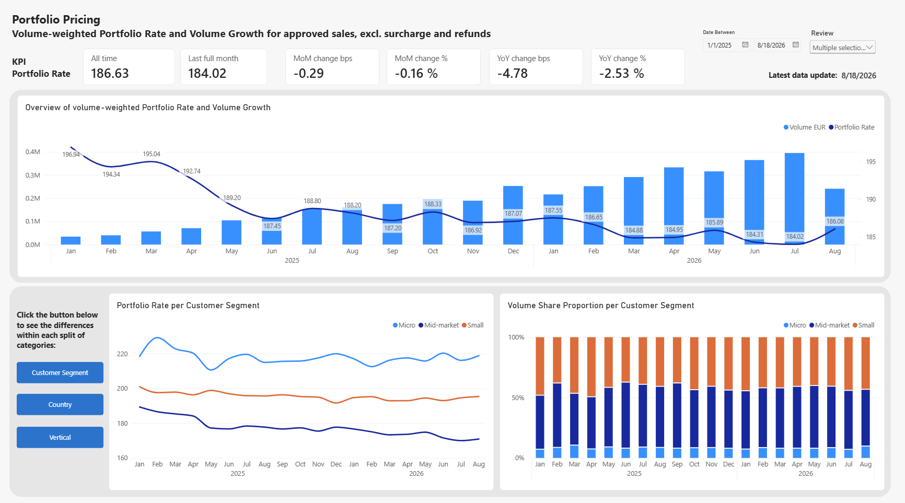
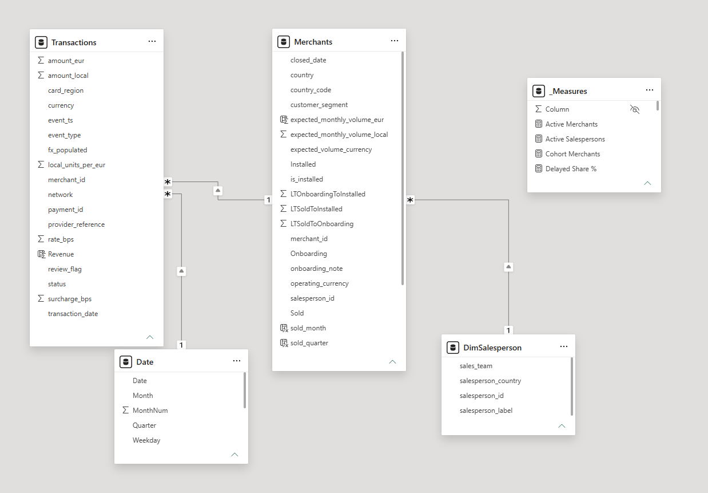
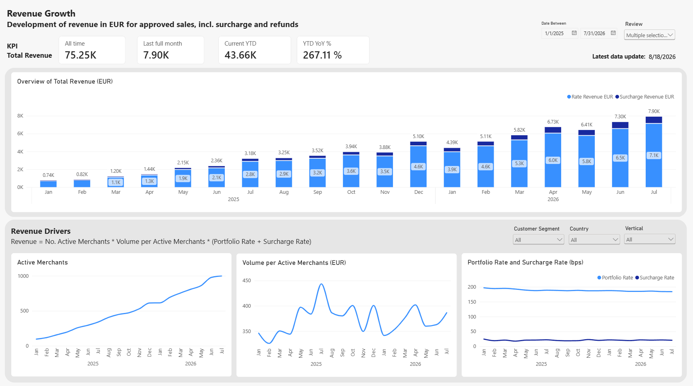
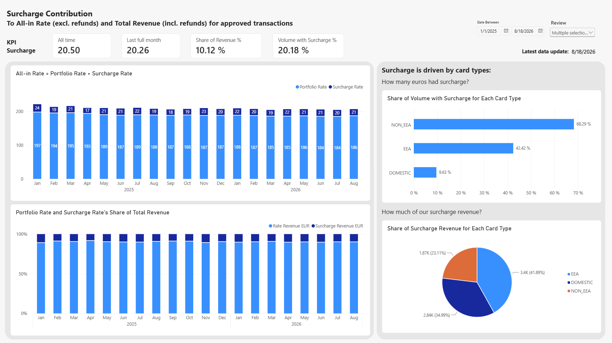
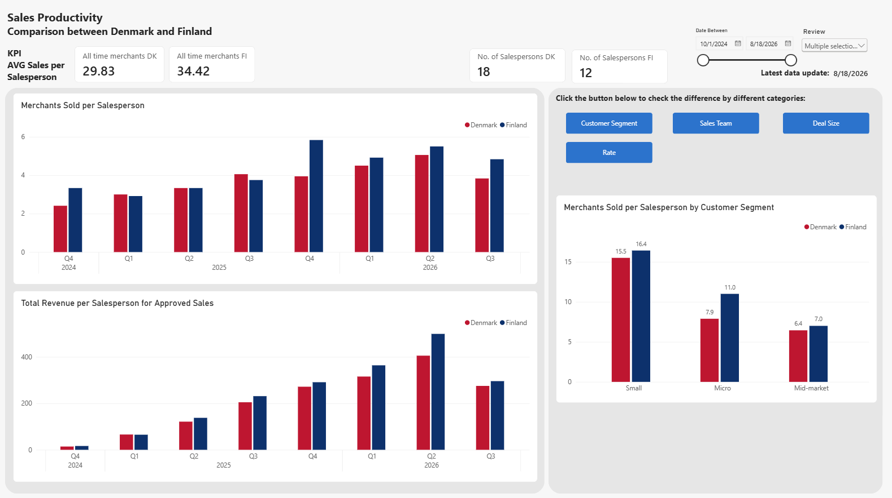
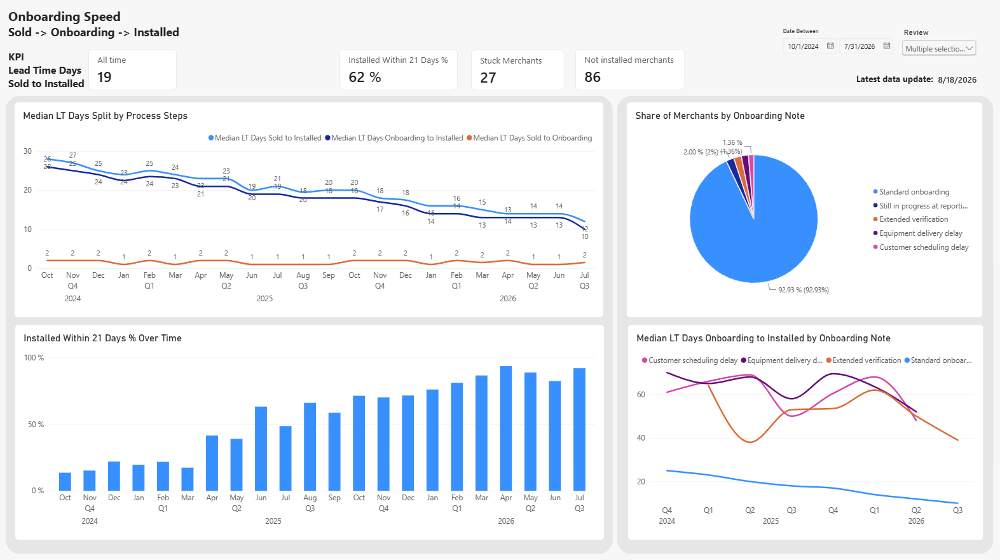

# Payments Portfolio Analytics in Power BI

BI analysis case for a fictional European payments provider ("Aster Lane Payments"). Five business questions (portfolio pricing, revenue, surcharge, sales productivity and onboarding), one Power BI report, one stakeholder presentation.

All data is synthetic and was supplied with the case. No real company data is included.



## The questions

| # | Question | Report page |
|---|----------|-------------|
| 1 | How has the portfolio's average rate developed month by month? | Portfolio Pricing |
| 2 | How has revenue in EUR developed month by month? | Revenue Development |
| 3 | How much does the surcharge product add to the portfolio rate? | Surcharge Contribution |
| 4 | What is the average number of sales per salesperson in Denmark and Finland? | Sales Productivity |
| 5 | Is onboarding getting faster? | Onboarding Speed |

Reporting cutoff is 18 August 2026, so the last month is incomplete and is flagged as such in the report.

## Key findings

- **Growth comes from more merchants, not higher prices.** Active merchants are up ~10x since January 2025. Revenue YTD is up more than 250% year over year.
- **The portfolio rate is falling**, from ~198 to ~186 bps. The drop sits almost entirely in the Mid-market segment (190 to 171 bps), whose volume share has stayed flat at ~50%.
- **Surcharge adds ~21 bps** to the all-in rate and ~10% of total revenue, stable over time. 80% of surcharge revenue comes from EEA and domestic cards, where EU surcharge rules are strict. Flagged as a compliance follow-up.
- **Finland outsells Denmark** by ~15% per salesperson, mainly through more Micro deals at a higher rate. Denmark closes fewer, larger deals at a lower rate and has a wider spread between salespeople.
- **Onboarding lead time has more than halved.** Median Sold to Installed went from ~26 to ~10 days. The improvement is entirely in the Onboarding to Installed step; Sold to Onboarding has stayed at 1 to 2 days.

## Data model

Five source tables (50k transactions, 1.5k merchants, 1.5k salespersons, 4.4k onboarding events, 2.1k FX rates) shaped in Power Query into a star schema:



Transformations done in Power Query (as the case required):

- **FX rates**: built a full daily calendar for all five currencies and filled missing rates forward. Assumption: weekend transactions settle at the next working day's rate (would confirm with Finance).
- **Transactions**: removed duplicate provider references, removed demo-account transactions, kept `DATA_INCIDENT` rows but exposed them through a `review_flag` slicer so the reader can include or exclude them. Converted amounts to EUR via the FX table.
- **Merchants**: removed demo accounts, merged in salesperson and onboarding timestamps.
- **Onboarding status**: pivoted stage events to one row per merchant with Sold, Onboarding and Installed timestamps and the onboarding note, then calculated lead time days between stages.
- **Salespersons**: split out into a proper dimension (deduplicated, merchant_id dropped).
- **Date table**: 1 October 2024 to 18 August 2026.

## KPI definitions

| KPI | Definition | Filter |
|-----|-----------|--------|
| Portfolio Rate (bps) | Σ(amount_eur × rate_bps) / Σ amount_eur | Approved sales only |
| Surcharge Rate (bps) | Σ(amount_eur × surcharge_bps) / Σ amount_eur | Approved sales only |
| Total Revenue EUR | Σ(amount_eur × (rate_bps + surcharge_bps)) / 10 000 | Approved sales and refunds |
| Surcharge Share of Revenue % | Surcharge revenue / Total revenue | |
| Volume with Surcharge % | Share of volume where surcharge_bps > 0 | |
| Merchants Sold per Salesperson | Merchants with a Sold timestamp / active salespersons | DK and FI |
| Median LT Days Sold to Installed | MEDIAN(Installed − Sold) | |
| Installed Within 21 Days % | Share of a sales cohort installed ≤ 21 days after sale | |

### Selected DAX

```dax
Portfolio Rate =
CALCULATE(
    DIVIDE(
    SUMX(Transactions, Transactions[amount_eur]*Transactions[rate_bps]),
    SUM(Transactions[amount_eur])),
    Transactions[status] = "APPROVED", Transactions[event_type] = "SALE" 
)

Median LT Days Onboarding to Installed = 
CALCULATE (
    MEDIAN ( Merchants[LTOnboardingToInstalled] ),
    TREATAS ( VALUES ( 'Date'[Date] ), Merchants[Sold] )
)

Installed Within 21 Days % = 
DIVIDE (
    CALCULATE ( [Merchants Sold],
        Merchants[is_installed] = TRUE (), Merchants[LTSoldToInstalled] <= 21 ),
    [Merchants Sold] )

Merchants Sold = 
CALCULATE (
    COUNTROWS ( Merchants ),
    TREATAS ( VALUES ( 'Date'[Date] ), Merchants[Sold] )
)

Share of Merchants % = 
DIVIDE (
    [Merchants Sold],
    CALCULATE ( [Merchants Sold], REMOVEFILTERS ( Merchants[onboarding_note] ) )
)
```

## Report design

- One page per business question, each with a KPI strip (all time, last full month, MoM and YoY change), a main trend chart and a breakdown area.
- Bookmark buttons switch the breakdown between Customer Segment, Country, Vertical, Sales Team and Deal Size without adding pages.
- A `review_flag` slicer on every page lets the reader include or exclude flagged data-incident rows.
- "Last full month" KPIs are used instead of "latest month" because the cutoff month is incomplete.
- A hidden Data Quality Check page documents the checks run on the source data (duplicates, status codes, currency mismatches, missing FX rates).

## Screenshots

| | |
|---|---|
|  |  |
|  |  |

## Files

- `Aster_Lane_Case.pbix` – the Power BI report with data model and Power Query transformations (data included, synthetic)
- `Aster_Lane_Presentation.pptx` – the stakeholder presentation
- `screenshots/` – report pages

## What I would do next

- Align with stakeholders on KPI definitions, targets and the data-incident handling.
- Compliance review of surcharge application on EEA and domestic cards.
- Split revenue growth into new vs. existing merchants and by market.
- Add churn and activation per salesperson to turn sales productivity into sales quality.
- Measure lead time from Installed to first transaction.
